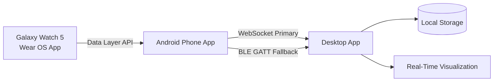
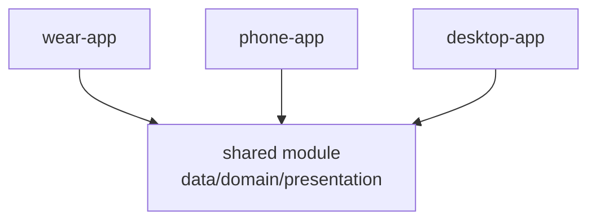
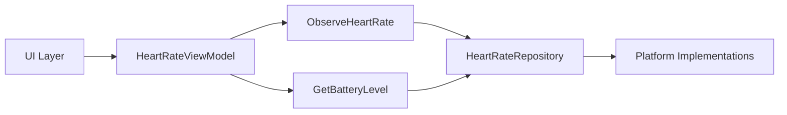
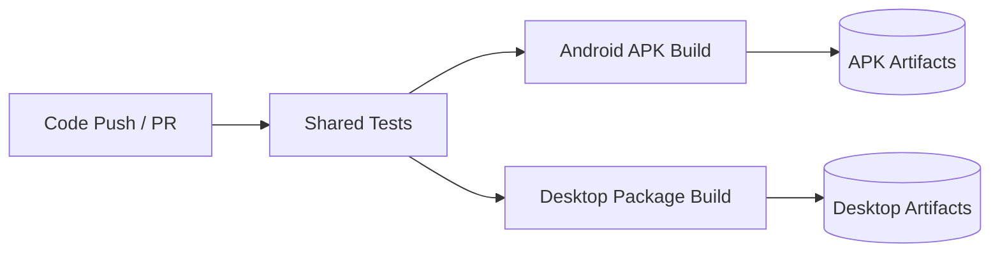

# Architecture Diagrams

## 1) End-to-End Data Flow

## 2) Module Structure

## 3) Shared Layer Architecture

## 4) Delivery Pipeline

## Notes

- Phone to desktop transmission is standardized as **WebSocket primary** with **BLE fallback**.
- The project remains Phase 1 scaffold-first, with real sensor and transport logic scheduled for later phases.
